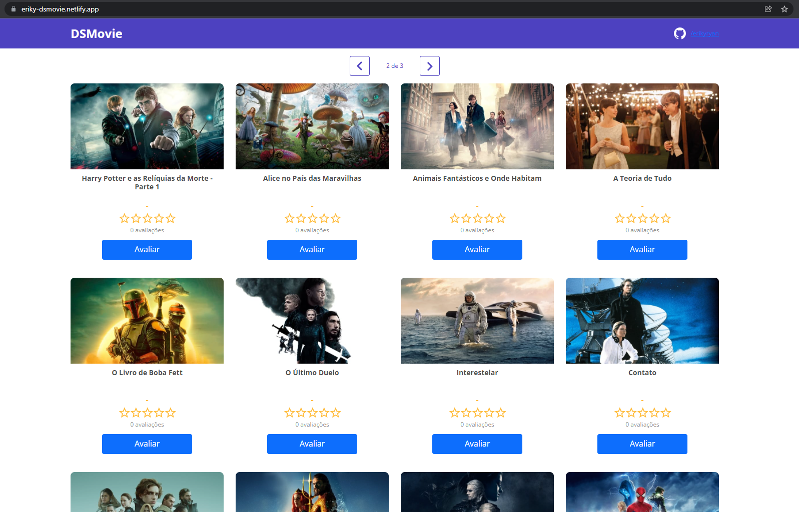

#  Spring React Week

## Realization
[DevSuperior - Programming school](https://devsuperior.com.br)

#  Semana Spring React

## Realização
[DevSuperior - Escola de programação](https://devsuperior.com.br)

Evento com objetivo de construir uma aplicação voltada para a avaliação de filmes e series

## Sobre o evento
Foi dividido em três aulas, com duração média de duas horas, sendo cada aula com objetivos definidos para se atingir. Além disso, foi disponibilizado materias de apoio e um guia de estudos para reforçar o conteúdo ministrado

## Tecnologias usadas
- Bootstrap
- React
- Spring Boot
_ Postgres
- TypeScript
- Heroku
- Netlify

## Resultados
Após a conclusão do evento foi possível a cosntrução de uma aplicação desde do backend ao frontend usando diversas tecnologias que acompanham o dia a dia de qualquer desenvolvedor. 
